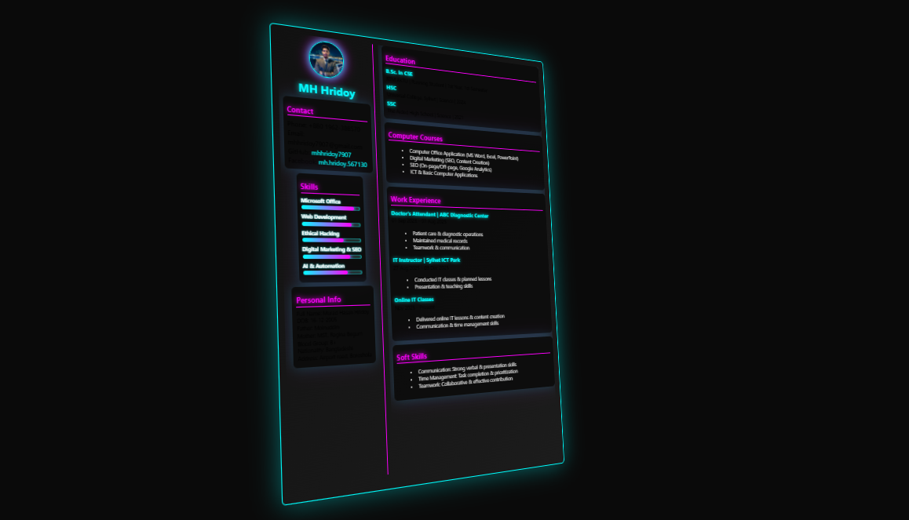

# 3D-CV-MH-Hridoy

Interactive 3D neon-styled CV/Resume built with **HTML, CSS, and JavaScript**. Fully responsive and A4 print-ready.

---

## Features

- **3D rotation effect** with auto-left-right tilt.
- **Neon-styled sections** for Skills, Education, Experience, and Personal Info.
- **Interactive skill bars** with animated filling.
- **Responsive layout** fits A4 outline perfectly.
- **Contact links** with clickable GitHub & Facebook.

---

## Demo



---

## Usage

1. Clone the repo:

```bash
git clone https://github.com/mhhridoy7907/3D-CV-MH-Hridoy.git
